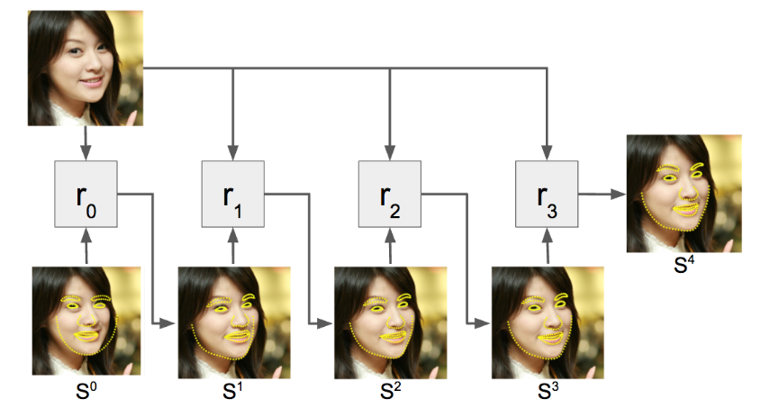
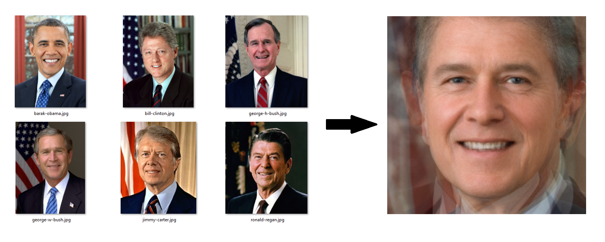
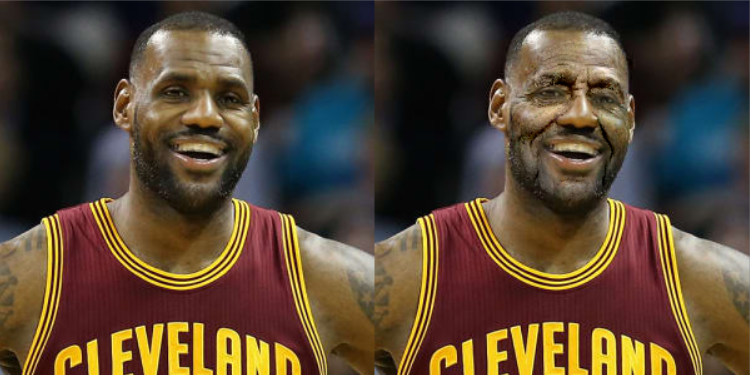
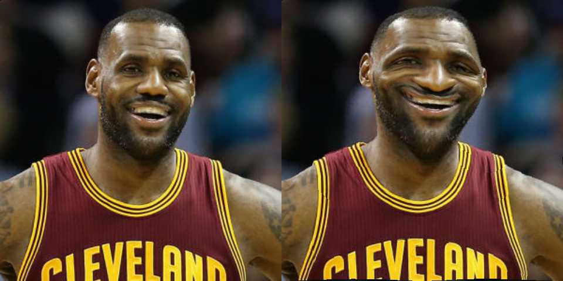
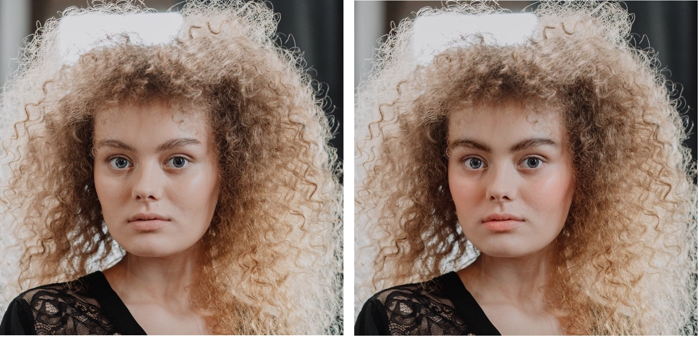

This repo are implementing facial landmarks detection and its applications. Facial landmarks can be achieved by a variety of techniques such as DNN. This repos implemented landmark detection using ensemble learning of regression ferns.
This repo contains item:
- Training a landmarks detector
- Ficial landmarks detection;
- Ficial landmarks applications;

## Theory of Facial Landmarks Detection
Ensemble of Regression Trees: a collection of gradient tree boosting:
1. Cascade of Regression: input a current shape estimae & facial image, and output the change in the current estimate that will produce a refined shape estimate.
2. Learning a Regressor: **a**. for each training image, choose an initial shapes by randomly sampling shapes from the shapes in the training set; **b**. calculate residual for each shape pair; **c**. train the regressor, so on so forth.

3. Regressor: **a**. each regressor is made up of K weak regressors; **b**. each weak regressor has a regression treem and the regressor is trained using gradient boosting; **c**. at each node of decision tree, test a feature and decide to either go left and right.
4. Features used in landmarks detector: pixel differences between two randomly selected pixels on the face;

## Facial Landmarks Application

### Technique CV Fundamentals
1. Alpha blending:
    * Background and Foreground: I = alpha\times B + (1-alpha)\times F
2. Affine transformation:
    * Affine: linear trasform (6 degree of freedom: 2-translation 1-oritation 1-shear 2-scale);
    * Perspective/Homography: nonlinear transform (8 degree of freedom).
3. Triangle warping:
    * image will be divided into non-overlapping triangles;
    * warping functions applied only at the verticles of the triangles to obtain locations in the output image.
4. Delaunay Trianglation:
    For generating non-overlapping triangles that cover the entire image.
5. Similarity transfrom
    An Affine transform without any shear. 

### Landmarks Applications
1. Face Averaging: Normalization wrt size, similarity transform for landmarks, align 2 landmarks of eyes. Align other facial landmarks: use landmarks to divided images into triangular regions before averaging pixel values.

2. Face Morphing: Find point correspondences using Landmark Detection, Coordinate transformation, Delaunay triangulation and Warping images and alpha blending.

3. Radial Distortion (Bug eyes): 
* Apply radial distortion to the eye patch: **a**. r_d = r+k\times r\times cos(pi\times r): to handle the artifact (curled corners) that outside r values: set distortion of 0, when r>0.5. **b**. Interpolate the points using remap function in opencv (pincushion distortion): r_d = r-k\times r\times cos(pi\times r).
4. Head Pose Estimation: **a**. Estimate 3D object: finding 6 numbers: 3 rotaion and 3 translation; **b**. Get Pitch Roll Yaw angles from rotation vector (RQDecomposition).
5. Swap Faces: Delaunay Triangulation + Affine warp triangles;
6. Beardify Filter: Delaunay Triangulation + Affine warp triangles + Alpha Blending using a transparency mask.
7. Aging Filter: Estimate Forehead Points + Predict based on current landmarks + Generate Mask using Convex hull.

8. Non-linear Deformations with Moving Least Square. For example the happify filter.

### CapStone Projection: Virtual Makeup
This project is trying to dig deeper for the potential application of AI models. We could see many successful application on market such Tictac, SnapChat... 
Interesting applications of facial features and landmarks. In this project, you will build features for a Virtual Makeup application! Given below are a few features that are required to be built in the application.
- Apply Lipstick
- Apply Eyebrows deepen
- Apply Blush

